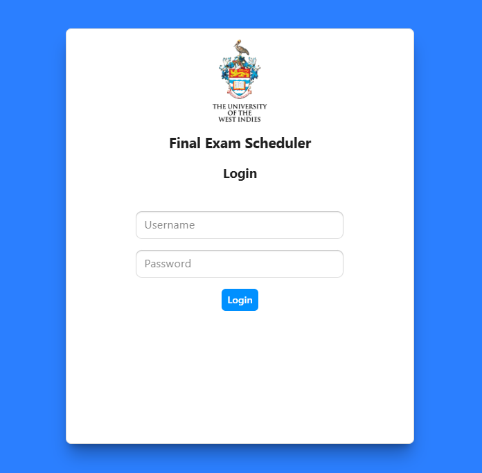
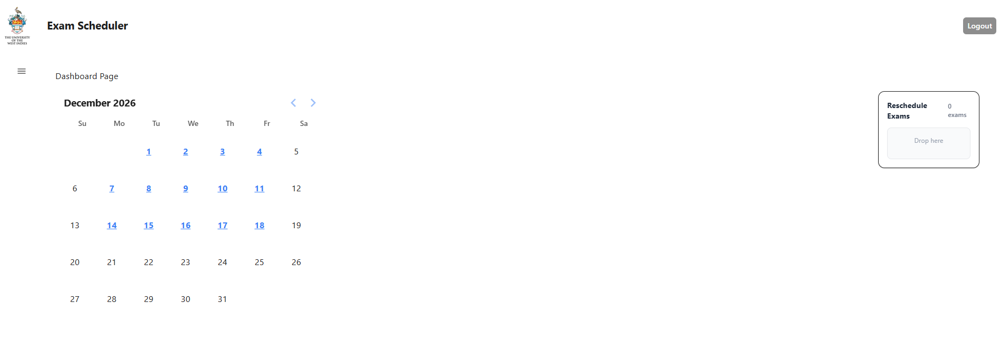
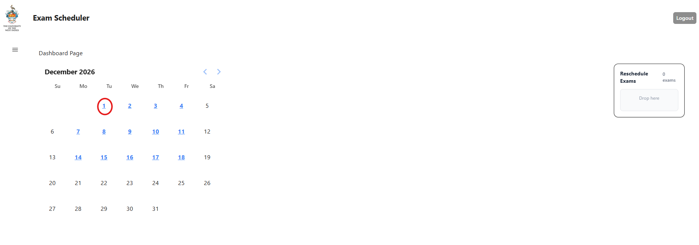
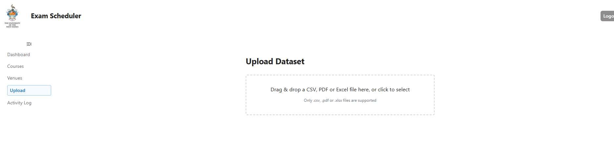

# UWI Final Exam Scheduler — Frontend

## Overview
This is the frontend for the UWI Final Exam Scheduler system. It is built using **Next.js with TypeScript** and provides the user interface for interacting with exam scheduling, data management, and administrative features.

---

## Tech Stack

- **Framework:** Next.js (React + TypeScript)
- **State Management:** Zustand
- **Data Fetching:** React Query
- **UI Components:** Radix UI, Tailwind CSS
- **Drag & Drop:** dnd-kit
- **File Uploads:** UploadThing
- **Notifications:** react-hot-toast

---

## Running the Frontend Locally

### Install Dependencies

```bash
pnpm install
```

If you don’t have pnpm installed:

```bash
npm install -g pnpm
```

---

### Start Development Server

```bash
pnpm dev
```

App will be available at:


[http://localhost:3000](http://localhost:3000)


---

## Environment Variables

Environment variables required for API connections and configuration will be provided separately during handover.

---


## Workflow

The general workflow for using the frontend is as follows:

---

### 1. Login

When accessing the application, users are first greeted with the login page.



After entering valid credentials, the user is authenticated and redirected into the system.

---

### 2. Dashboard

Upon successful login, the user is taken to the dashboard.



The dashboard serves as the central hub of the application and provides:
- An overview of the current scheduling state
- Access to scheduling tools
- Navigation to other system features

---

### 3. Scheduling Exams (If Data Already Exists)

If the database has already been populated and processed, users can immediately begin scheduling exams by clicking a day hilighted blue as seen here on the dashboard.



From the dashboard:
- The calendar interface is used to assign exams to timeslots and venues
- Users can interact with the scheduling view to manage allocations
- Changes are reflected dynamically in the timetable

---

### 4. Uploading Data (Initial Setup)

If the database has not yet been populated, users can upload the required data.



The system provides an upload feature that:
- Accepts a PDF document containing exam information
- Parses the document automatically
- Extracts relevant data and inserts it into the database (e.g., Exams table)

This step is typically performed once per dataset before scheduling begins.

---

### 5. Managing the Scheduling Process

Once data is available, users can:
- Adjust exam placements via the calendar
- Resolve scheduling conflicts
- Refine the timetable as needed


---

### 6. End-to-End Flow Summary

1. User logs in  
2. User is directed to the dashboard  
3. If data exists → proceed to scheduling via calendar  
4. If no data exists → upload PDF to populate database  
5. Use scheduling tools to organise exams  

--- 

